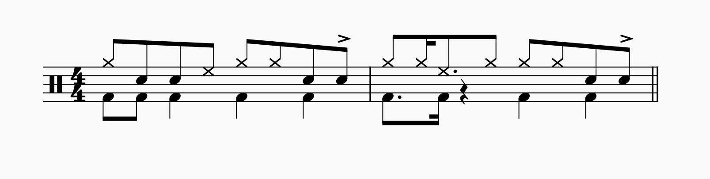
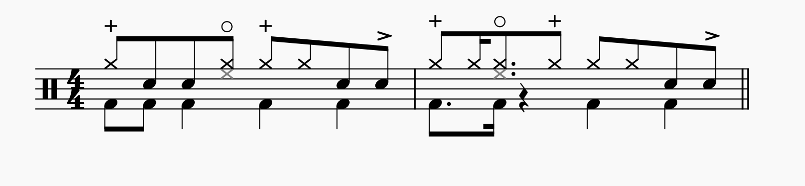

# musescore-plugins
A (hopefully) growing set of MuseScore plugins for various purposes.

## Hi-Hat Notation Converter
Converts hi-hat notes in selected range from 'Musescore style', where open and closed hi-hats are on different lines, to a more conventional style using open and closed mute symbols from the master pallete with playback.

*Last updated on 2023-07-14 working with Musescore 4.1.0*

## Contributors
aero
 &ensp;&ensp;Discord: @hearg
